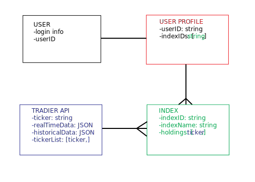

# walk-with-me

## HEADLINE
"Myndex" is an online application that allows to create their own custom stock indeces and view their performance.

## ABOUT THIS PROJECT
Investors, financial service providers and decision makers are constantly searching through mountains of data to find information that they think is actionable or relevant. While there are many existing and well-known metrics to help these individuals track business and economic performance (i.e. the Dow Jones Index or Russell 200 Index), sometimes these benchmarks don't provide the dexterity or scope required to provide the most accurate picture of the question at hand.

Perhaps Michigan's governor would like to know the state of the state of its economy, but can't rely on available metrics because they are dominated by auto manufacturers.  With Myndex, the governor could freely create a 'Michigan Ex-Auto' index as a cleaner measure of performance.  An individual investor who wanted to keep an eye on electric car companies, but only the ones under certain market capitalization, could do this in a snap with Myndex.

Myndex uses MongoDB, Express, React and Node.js to give users the clarity in securities markets that they need to make the best decisions.

## WIRE FRAMES
- **Landing page** 

- **Login page** 

- **Signup page** 

- **Dog index page** 

- **User index page** 

- **User page** 

- **Dog page** 

- **Booking page** 

## User Stories
- Upon arriving onsite, viewers will be presented with the Myndex home page featuring options to sign up or login.
- Viewers who have not previously registered navigate to a registration page where they can establish login credentials and become users.
- After succesfully logging in, users will be presented with their dashboard that presents them with their current indeces and their performance as well as the option to create a new index.
- Selecting an individual index from the dashboard page will present the user with a 'show' page containing all the components of that index as well as options to edit or delete that index.
- Clicking edit/delete will lead the user to a page giving them the option to update that individual index or delete is alltogether.
- Clicking on 'create' in the dashboard page will lead the user to an index creation page that will allow them to create a new index of their own by selecting one or more securities 

## Database Model

